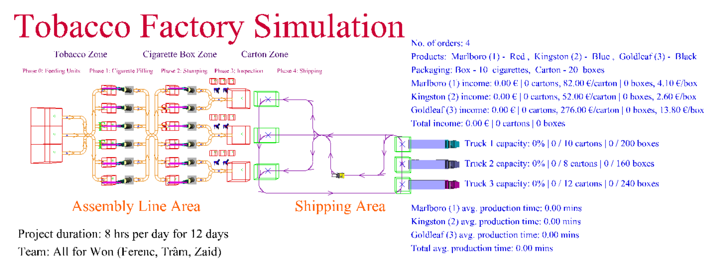

# Digital Production - Assembly Line Optimization

## Table of Contents
1. [Project Overview](#1-project-overview)
2. [Development Tools](#2-development-tools)
3. [Demo](#3-demo)
4. [Authors](#4-authors)

## 1. Project Overview

This project was developed for submission in **Digital Production and Logistics Systems** course at **[University of Trento](https://www.unitn.it/en)**.

The main goal was to create a digital twin of a particular tobacco factory that possesses multiple degrees of freedom to let the user configure its layout and critical parameters which are directly influencing different KPIs related to the two main areas of the factory:
1. Assembly Line Area
2. Shipping Area

These two areas can be divided into distinct zones and phases. The zones represent different appearances of products (tobacco, cigarette box and carton) while the phases define the work processes to be carried out right from the beginning up until the sale.

#### Layout of the Tobacco Factory:

### 1.1 Terminologies

- **CFM**: Cigarette-filling machine, used for filling tobacco into a cigarette filter to create a cigarette.
- **SM**: Stamping machine, used for stamping boxes of cigarettes with a brand.

### 1.2 Areas

The factory consists of two main areas:

1. **Assembly Line Area**: Uses a conveyor belt system to transport tobacco from feeding units through several phases up to cartoning.
2. **Shipping Area**: Uses a path mover system, that utilizes the available forklifts to transport every finished carton to its appropriate truck.

### 1.3 Zones

Three zones can be distinguished within the factory (in order):

1. **Tobacco zone**: Each tobacco load represents a "piece" of tobacco that is enough to create a cigarette. They travel from the feeding units to the CFM.
2. **Cigarette box zone**: Each cigarette box load represents 10 cigarettes (or, equivalently, 10 pieces of tobacco). They travel from CFM to SM.
3. **Carton zone**: Each carton load represents 20 boxes of cigarettes. They travel from inspection and cartoning to the appropriate truck for shipping purposes.

### 1.4 Phases

Five phases can be distinguished within the factory (in order):

0. **Feeding units**: Provide 10 pieces of tobacco randomly between 5 and 8 seconds.
1. **Cigarette-filling**: Every piece of tobacco gets filled into filters by a cigarette-filling machine. After 10 pieces of tobacco, a box of cigarettes is created.
2. **Stamping**: Every box of cigarette gets stamped with a brand by a stamping machine.
3. **Inspection**: Every box of cigarette gets inspected by an operator to avoid defects and faults. After 20 boxes, a carton is created.
4. **Shipping**: Every carton gets transported by a forklift to the destination truck.

### 1.5 Product Descriptions

The project manages and produces 3 different brands of products:
- **Marlboro**: €4.1/box, red colored, market demand: 50%
- **Kingston**: €2.6/box, blue colored, market demand: 30%
- **Goldleaf**: €13.8/box, black colored, market demand: 20%

### 1.6 Key Performance Indicators (KPIs)

The evaluation of the simulation performance is based on 3 main KPIs:
1. **Total number of cartons sold**: Number of cartons sold per product and in total. Reflects income.
2. **Average production time (minutes)**: Average time of cartons produced per product and in total. Reflects performance.
3. **Average utilization rate**: Average utilization of CFMs, SMs, inspection operators and forklifts. Reflects cost effectiveness.

These KPIs are obviously highly dependent on each other, so a balance must be found between them that satisfies the final requirement: **a total number of cartons sold over 200 per 8-hour shift while the average utilization rate of resources is high enough with respect to market demand**.

### 1.7 Available Resources

- 6 CFMs
- 6 SMs
- 6 inspection operators
- 3 inspection stations
- 2 forklifts

### 1.8 Final Results

Different factory configurations led to different KPI values. With a series of optimization steps and configuration changes, a strong performance improvement was achieved.

### Initial Configuration

| TOTAL NUMBERS OF CARTONS SOLD | AVERAGE PRODUCTION TIME (MINUTES) | UTILIZATION RATE (AVERAGE) |
|-------------------------------|-----------------------------------|-----------------------------|
| Product 1: 104                | Product 1: 18.43                  | CFMs: ~85%                  |
| Product 2: 61                 | Product 2: 26.73                  | SMs: ~16.8%                 |
| Product 3: 41                 | Product 3: 35.85                  | Inspection operators: ~35%  |
| Total: 206                    | Total average: 24.50              | Forklifts: ~20% |

### Optimized Configuration

| TOTAL NUMBERS OF CARTONS SOLD | AVERAGE PRODUCTION TIME (MINUTES) | UTILIZATION RATE (AVERAGE) |
|-------------------------------|-----------------------------------|-----------------------------|
| Product 1: 106                | Product 1: 8.72                   | CFMs: ~95%                  |
| Product 2: 64                 | Product 2: 12.26                  | SMs: ~91%                   |
| Product 3: 42                 | Product 3: 15.59                  | Inspection operators: ~75%  |
| Total: 212                    | Total average: 11.16              | Forklifts: ~38% |

It can be concluded that all KPIs taken into account have improved significantly.

## 2. Development Tools

**Software Tools**:
- **[AutoMod](https://www.automod.se/eng/home.html)**: A world-leading software for simulation of production and logistics systems. The software is designed for detailed analysis of operations and flows.

## 3. Demo

The project is not uploaded, and access to its contents is provided upon request.

## 4. Authors
- Zaid Khan
- Thi Trâm Van
- Ferenc Szendrei

[Back to Top](#digital-production---assembly-line-optimization)
